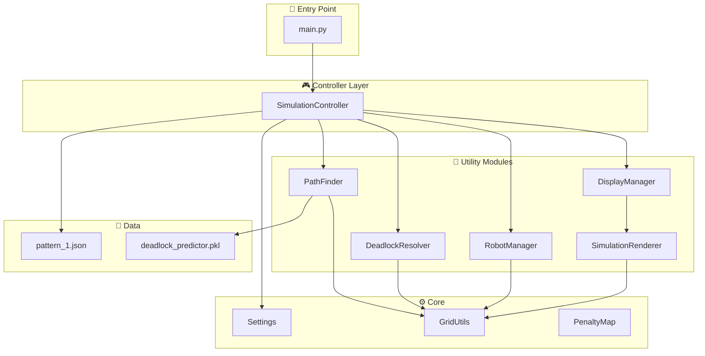
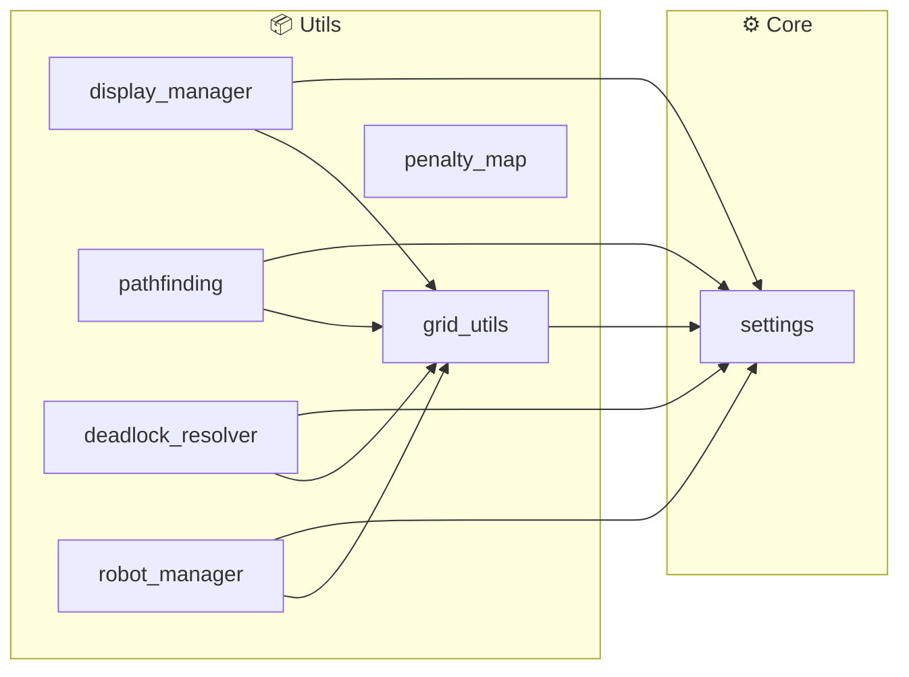
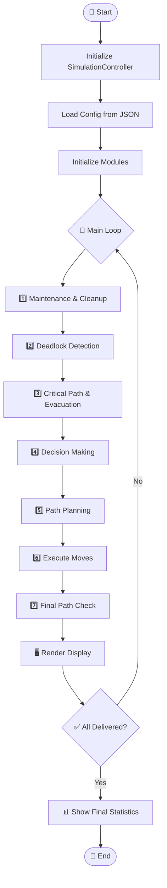
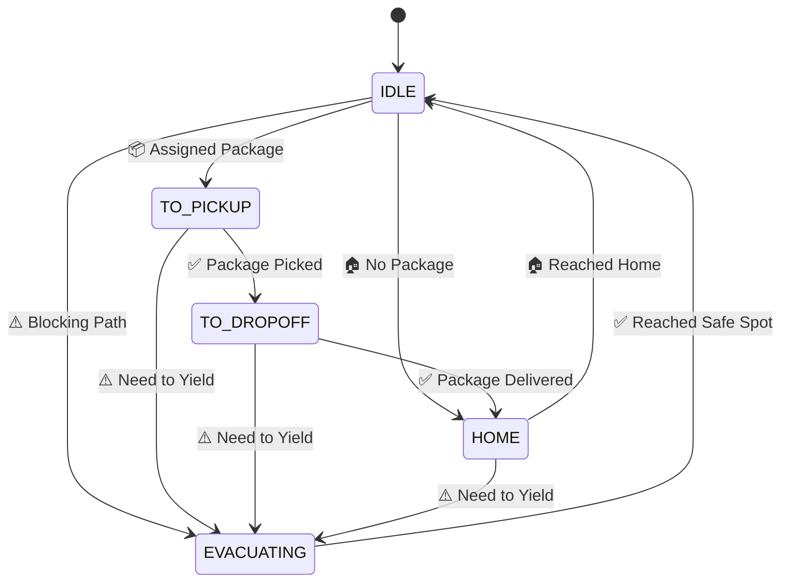
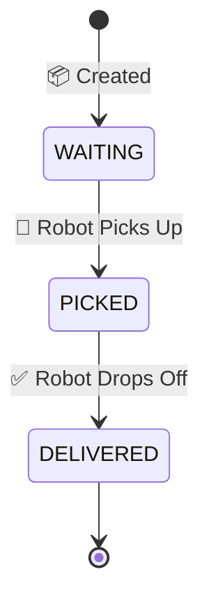
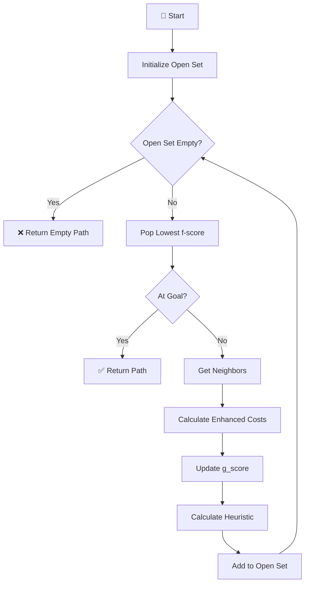
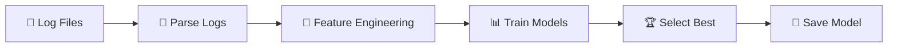

<p align="center">
  
  
  
</p>

# 🤖 Smart Logistics Simulation (SLS_ANSI)

> **Multi-Agent Autonomous Robot Simulation** สำหรับจำลองการทำงานของระบบ Logistics อัตโนมัติในคลังสินค้า พร้อม AI-powered Deadlock Prediction และ Real-time ANSI Terminal Visualization

---

## ✨ Features

- 🚀 **Multi-Robot Coordination** - จัดการหุ่นยนต์หลายตัวพร้อมกันโดยไม่ชนกัน
- 🧠 **AI-Powered Deadlock Prediction** - ใช้ ML Model ทำนายการติดขัดล่วงหน้า
- 🗺️ **Smart A\* Pathfinding** - อัลกอริทึมหาเส้นทางที่ปรับปรุงพร้อม dynamic cost calculation
- 🔄 **Automatic Deadlock Resolution** - แก้ไข deadlock อัตโนมัติด้วย yield/retreat strategies
- 📊 **Real-time ANSI Visualization** - แสดงผลแบบ real-time บน terminal
- ⚙️ **Configurable Scenarios** - ปรับแต่งสถานการณ์ผ่าน JSON config

---

## 📸 Demo

```
╔════════════════════════════════════════════════════════════════════════════════════════════════════╗
║                                   🤖 SMART LOGISTICS SIMULATION 🤖                                   ║
╚════════════════════════════════════════════════════════════════════════════════════════════════════╝
 Step: 42    | Time: 00:21 | Moves: 156 | Pickups: 8 | Dropoffs: 5 | Deadlocks: 2

📋 LEGEND:  IDLE   TO_PICKUP   DELIVERING   HOME   EVAC/YIELD  P=Pickup D=Dropoff

📊 STATISTICS:
   Progress: 5/25 (20.0%) [████████░░░░░░░░░░░░░░░░░░░░░░░░░░░░░░░░]
   Robots: IDLE=5 | TO_PICKUP=8 | DELIVERING=5 | HOME=2 | EVAC=0
```

---

## 🚀 Quick Start

### Prerequisites

```bash
# Python 3.8+
python --version

# Required packages
pip install loguru pandas joblib numpy
```

### Installation

```bash
# Clone หรือ copy โปรเจกต์
cd /home/public_html/apiservices/projects/sls_ansi

# รัน simulation
python main.py
```

### Configuration

แก้ไขไฟล์ `data/pattern_1.json` เพื่อปรับแต่ง:

```json
{
  "robots": [{ "id": 1, "name": "R1", "pos": [0, 0] }],
  "packages": [{ "name": "P1", "pickup": [3, 10], "dropoff": [0, 79] }],
  "walls": [[1, 5, 1, 35]],
  "settings": {
    "rows": 26,
    "cols": 80,
    "sleep": 0.5,
    "max_steps": 1000
  }
}
```

---

## 📁 Project Structure

```
sls_ansi/
├── 📄 main.py                        # Entry point & main simulation loop
├── 📁 controllers/
│   └── simulation_controller.py      # Main controller (Composition Pattern)
├── 📁 core/
│   └── settings.py                   # Configuration settings
├── 📁 utils/
│   ├── display_manager.py            # UI/Display & ANSI rendering
│   ├── pathfinding.py                # A* Algorithm & path planning
│   ├── deadlock_resolver.py          # Deadlock detection & resolution
│   ├── robot_manager.py              # Robot & package management
│   ├── grid_utils.py                 # Grid utilities & helpers
│   └── penalty_map.py                # Dynamic penalty system
├── 📁 data/
│   └── pattern_1.json                # Simulation configuration
├── 📁 models/
│   └── deadlock_predictor.pkl        # ML model for deadlock prediction
└── 📁 logs/                          # Runtime logs (auto-generated)
```

---

## 🏗️ Architecture

### System Overview



### Module Dependencies



---

## 🔄 Simulation Workflow

### Main Loop (7 Steps)



### Step Details

| Step | Name                   | Description                                                       |
| ---- | ---------------------- | ----------------------------------------------------------------- |
| 1    | **Maintenance**        | แก้ไข state ผิดปกติ, ล้าง orphaned assignments, reassign packages |
| 2    | **Deadlock Detection** | ตรวจจับกลุ่ม robots ที่ติดขัดกัน                                  |
| 3    | **Critical Path**      | หลบให้ robots ที่กำลังส่งของ (priority สูงสุด)                    |
| 4    | **Decision Making**    | ตัดสินใจ yield/retreat/emergency สำหรับ robots ที่รอนาน           |
| 5    | **Path Planning**      | หาเส้นทางด้วย A\* Algorithm                                       |
| 6    | **Execute Moves**      | เคลื่อนที่จริง พร้อมตรวจสอบ collision                             |
| 7    | **Final Check**        | ตรวจสอบและแก้ไข path ที่หายไป                                     |

---

## 🤖 Robot State Machine



---

## 📦 Package State Machine



---

## 🎯 A\* Algorithm (Enhanced)

### Cost Calculation Formula

```
total_cost = base_cost (1.0)
           + robot_bias (prevent same path selection)
           + ai_deadlock_penalty (ML prediction)
           + turn_penalty (1.5x for turns)
           + dynamic_traffic_cost (future collision prediction)
           + corridor_bonus (prefer wide paths)
           + momentum_bonus (prefer straight lines)
           + goal_proximity_bonus (near goal = lower cost)
           + narrow_passage_penalty (avoid bottlenecks)
```

### Algorithm Flow



---

## 🧩 Class Reference

| Class                  | File                       | Description                                 |
| ---------------------- | -------------------------- | ------------------------------------------- |
| `SimulationController` | `simulation_controller.py` | Main orchestrator, uses Composition pattern |
| `PathFinder`           | `pathfinding.py`           | Enhanced A\* with ML deadlock prediction    |
| `DeadlockResolver`     | `deadlock_resolver.py`     | Detect & resolve multi-robot deadlocks      |
| `RobotManager`         | `robot_manager.py`         | Package assignment & robot lifecycle        |
| `DisplayManager`       | `display_manager.py`       | Activity tracking & statistics              |
| `SimulationRenderer`   | `display_manager.py`       | ANSI terminal rendering                     |
| `GridUtils`            | `grid_utils.py`            | Position parsing & grid helpers             |
| `DynamicPenaltyMap`    | `penalty_map.py`           | Traffic-based penalty system                |
| `Settings`             | `settings.py`              | Configuration constants                     |

---

## ⚙️ Configuration Reference

### Settings (settings.py)

| Parameter            | Default | Description                    |
| -------------------- | ------- | ------------------------------ |
| `ROWS`               | 26      | จำนวนแถวของ grid               |
| `COLS`               | 80      | จำนวนคอลัมน์ของ grid           |
| `SLEEP`              | 0.5     | เวลาหน่วง (วินาที) ต่อ step    |
| `MAX_STEPS`          | 1000    | จำนวน step สูงสุด              |
| `YIELD_THRESHOLD`    | 3       | จำนวน wait ก่อนพิจารณา yield   |
| `DEADLOCK_THRESHOLD` | 15      | จำนวน wait ก่อนถือว่า deadlock |
| `TURN_PENALTY`       | 1.5     | cost เพิ่มเมื่อเลี้ยว          |
| `CORRIDOR_BONUS`     | 0.8     | ลด cost เมื่อเดินในทางกว้าง    |

### JSON Config Format

```json
{
  "robots": [
    {
      "id": 1, // Robot ID (unique)
      "name": "R1", // Display name
      "pos": [0, 0] // Initial position [row, col]
    }
  ],
  "packages": [
    {
      "name": "P1", // Package name
      "pickup": [3, 10], // Pickup location
      "dropoff": [0, 79] // Dropoff location
    }
  ],
  "walls": [
    [1, 5, 1, 35] // Wall definition [r1, c1, r2, c2]
  ],
  "settings": {
    "rows": 26,
    "cols": 80,
    "sleep": 0.5,
    "max_steps": 1000
  }
}
```

---

## 📊 Logs

Logs ถูกบันทึกใน `logs/{timestamp}/`:

| File               | Content                        |
| ------------------ | ------------------------------ |
| `system.log`       | Overall system events          |
| `{robot_name}.log` | Per-robot movement & decisions |

---

## 🛠️ Development

### Adding New Robot Behaviors

```python
# ใน RobotManager.fix_robot_states()
def fix_robot_states(self):
    for rb in self.robots:
        # Add your custom state fix logic here
        pass
```

### Customizing A\* Cost

```python
# ใน PathFinder.smart_astar()
# เพิ่ม cost calculation ใหม่:
move_cost += your_custom_penalty * weight
```

### Creating New Patterns

สร้างไฟล์ใหม่ใน `data/`:

```bash
cp data/pattern_1.json data/pattern_2.json
# แก้ไข pattern_2.json
# อัพเดท settings.PATTERN_DIR ใน settings.py
```

---

## 🧠 Model Training

### Deadlock Predictor Model

ระบบใช้ ML Model เพื่อทำนาย deadlock ล่วงหน้า สามารถเทรนใหม่จาก logs ได้

#### Training Commands

```bash
cd /home/public_html/apiservices/projects/sls_ansi

# ใช้ log directory ล่าสุด
python scripts/train_deadlock_model.py

# ใช้ log directory เฉพาะ
python scripts/train_deadlock_model.py --logs-dir logs/20251220_003401

# ใช้ทุก log directories
python scripts/train_deadlock_model.py --all-logs

# กำหนด output path และ cross-validation folds
python scripts/train_deadlock_model.py --output models/new_model.pkl --cv 10
```

#### Training Pipeline



#### Features Used

| Feature                | Description                                  |
| ---------------------- | -------------------------------------------- |
| `from_row`, `from_col` | ตำแหน่งปัจจุบัน                              |
| `to_row`, `to_col`     | ตำแหน่งเป้าหมาย                              |
| `dir_row`, `dir_col`   | ทิศทางการเคลื่อนที่                          |
| `wait`                 | จำนวน steps ที่รอ                            |
| `state_*`              | State encoding (TO_PICKUP, TO_DROPOFF, etc.) |
| `mode_*`               | Mode encoding (NORMAL, YIELDING, FORCED)     |
| `recent_blocks`        | จำนวน BLOCKED events ล่าสุด                  |
| `recent_moves`         | จำนวน MOVE events ล่าสุด                     |

#### Models Compared

- **RandomForest** - Tree-based ensemble
- **GradientBoosting** - Boosted trees
- **LogisticRegression** - Linear model

Best model is selected by **F1 Score** and saved automatically.

#### Log Format

```
2025-12-20 00:34:05 | MOVE [2, 2] -> [2, 3] | STATE=TO_PICKUP | MODE=NORMAL
2025-12-20 00:34:05 | BLOCKED [5, 3] -> [6, 3] | WAIT=0
2025-12-20 00:34:05 | YIELD to R5 -> [3, 4]
2025-12-20 00:34:05 | RETREAT -> [2, 1]
2025-12-20 00:34:05 | EMERGENCY MOVE -> [1, 3]
```

#### Improving Model Performance

1. **Collect more data** - รัน simulation หลายครั้งเพื่อเพิ่ม samples
2. **Balance classes** - Script มี auto-augmentation สำหรับ deadlock samples
3. **Tune hyperparameters** - แก้ไขใน `train_deadlock_model.py`

---

## 📈 Performance Metrics

เมื่อ simulation จบ จะแสดง:

- **Total Steps** - จำนวน step ทั้งหมด
- **Elapsed Time** - เวลาที่ใช้จริง
- **Packages Delivered** - จำนวน package ที่ส่งสำเร็จ
- **Total Moves** - จำนวนการเคลื่อนที่ทั้งหมด
- **Deadlocks Resolved** - จำนวน deadlock ที่แก้ไข
- **Delivery Rate** - อัตราการส่ง (% per step)
- **Moves per Package** - จำนวน moves เฉลี่ยต่อ package

---

## 🤝 Contributing

1. Fork the repository
2. Create feature branch (`git checkout -b feature/amazing-feature`)
3. Commit changes (`git commit -m 'Add amazing feature'`)
4. Push to branch (`git push origin feature/amazing-feature`)
5. Open Pull Request

---

## 📝 License

MIT License - see [LICENSE](LICENSE) for details.

---

## 👤 Author

**TiwKill**

---

<p align="center">
  Made with ❤️ and 🐍 Python
</p>
